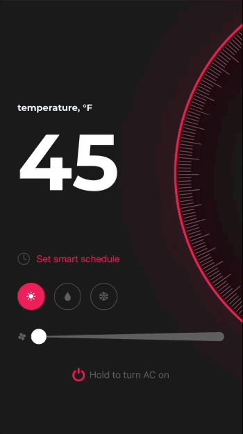

<br><br>
# Thermostat


Thermostat is a Swift component designed to control the temperature with a simple swipe. 

- [Requirements](#requirements)
- [Installation](#installation)
- [License](#license)

Thermostat allows the user to increase or decrease the temperature by swiping the scale up or down. Moreover, one can adjust additional parameters like fan speed and air conditioner mode, turn it on or off, and set a timer. 

Here’s an example of the Thermostat animation:



## Requirements

- iOS 11.0+
- Xcode 11.0+
- Swift 5.0+

## Installation

### CocoaPods

To integrate Thermostat into your Xcode project with CocoaPods, specify it in your `Podfile`:

```ruby
pod 'Thermostat', :git => 'https://github.com/shakurocom/ThermostatControl.git', :commit => d985d6caadad129480c0ffac0b72a6bb5d69de3f
```

Then, run the following command:

```bash
$ pod install
```

### Manually

If you prefer not to use CocoaPods, you can integrate Shakuro.Thermostat simply by copying it to your project.

## License

Shakuro Thermostat is released under the MIT license. [See LICENSE](https://github.com/shakurocom/ScrollableTabs/blob/master/LICENSE.md) for details.

## Give it a try and reach us

Star this tool if you like it, it will help us grow and add new useful things. 
Feel free to reach out and hire our team to develop a mobile or web project for you.


